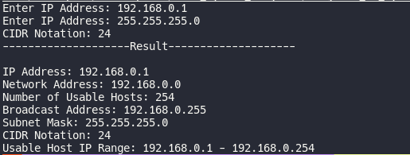

# PyIpv4 Subnet Calculator

This calculator returns a variety of information regarding Internet Protocol version 4 (IPv4) subnets including possible network addresses, usable host ranges, subnet mask, and IP class, among others.
